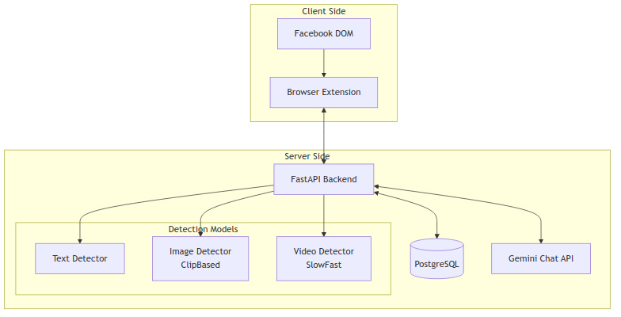
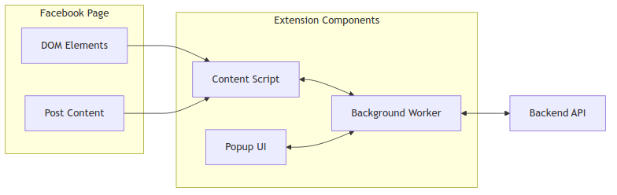
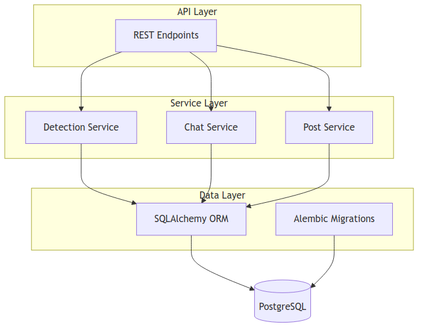
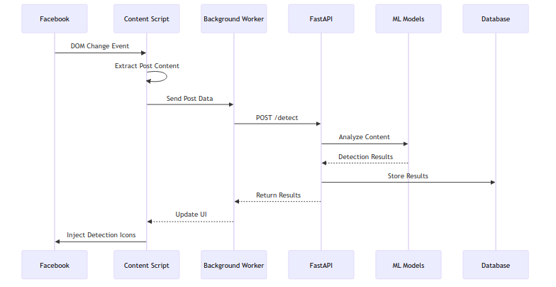
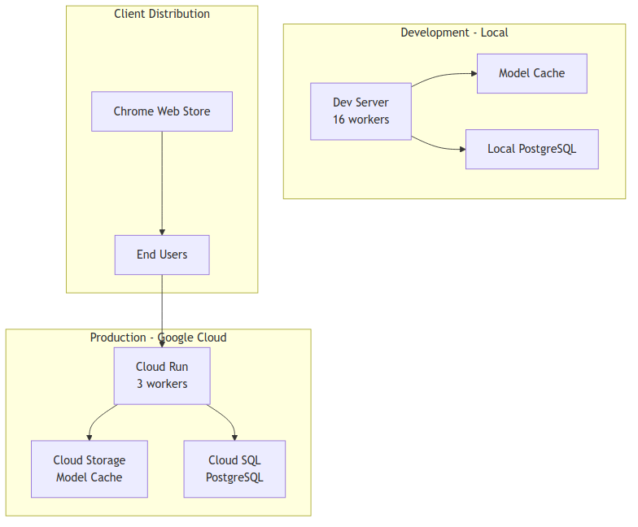

# System Architecture

## Overview

AI Slop Detection is a distributed system for detecting AI-generated content on Facebook, consisting of a browser extension frontend and a FastAPI backend with multi-modal detection capabilities.

## High-Level Architecture

## Component Architecture

### Browser Extension

### Backend Services

## Data Flow

## Key Components

### Frontend Components
- **Content Script**: Monitors Facebook DOM, extracts posts, injects UI elements
- **Background Worker**: Manages API communication, handles messaging between components
- **Popup Interface**: User settings and extension controls

### Backend Components
- **API Layer**: RESTful endpoints for detection, chat, and data management
- **Detection Services**: Orchestrates multi-modal AI analysis (text, image, video)
- **Database Layer**: PostgreSQL with SQLAlchemy ORM for persistence
- **Chat Integration**: Gemini API for contextual conversations

### Detection Pipeline
- **Text Detection**: Pattern-based analysis for AI-generated text
- **Image Detection**: CLIP-based visual analysis using OpenCLIP models
- **Video Detection**: Temporal analysis using SlowFast framework

## Deployment Architecture

## Technology Stack

### Frontend
- **Runtime**: Chrome Extension (Manifest V3)
- **Language**: TypeScript
- **Build**: Webpack
- **UI Framework**: Vanilla JS with injected components

### Backend
- **Framework**: FastAPI (Python)
- **Database**: PostgreSQL with SQLAlchemy
- **ML Frameworks**: PyTorch, OpenCLIP, SlowFast
- **Chat**: Google Gemini API
- **Server**: Uvicorn with multi-worker support

### Infrastructure
- **Production**: Google Cloud Run
- **Storage**: Google Cloud Storage
- **Database**: Cloud SQL (Production), Local PostgreSQL (Development)
- **CI/CD**: Google Cloud Build

## Communication Protocols

- **Extension ↔ Backend**: REST API over HTTPS
- **Backend ↔ Database**: PostgreSQL protocol via SQLAlchemy
- **Backend ↔ ML Models**: In-memory Python function calls
- **Backend ↔ Gemini**: REST API with API key authentication