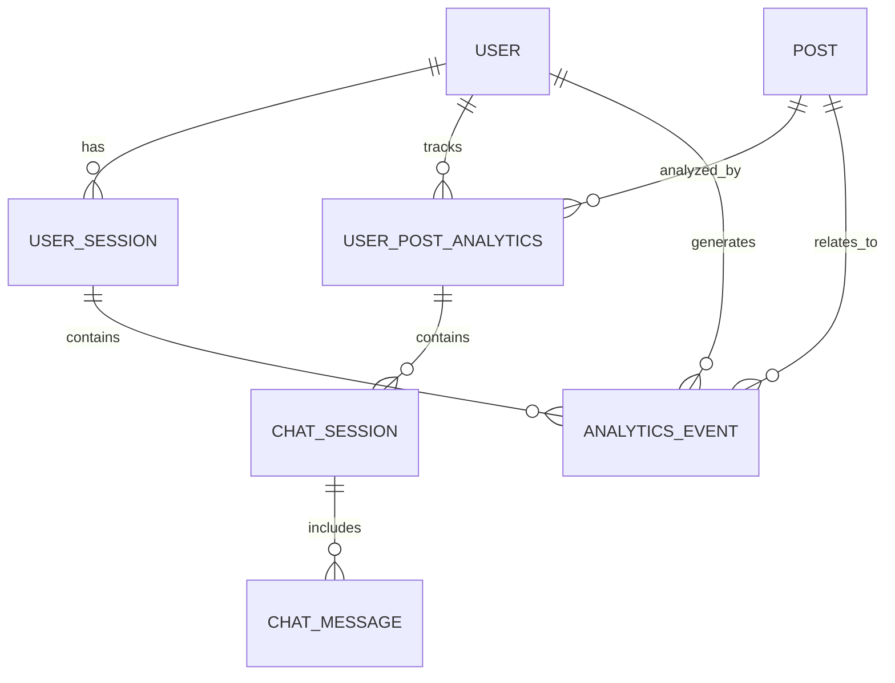

# Database Schema Documentation

## Overview

This document outlines the comprehensive database schema for the AI Slop Detection browser extension, covering user interactions, post analysis, behavioral metrics, and chat functionality.

## Architecture Summary

The database is designed to track:
- **User behavior** and interaction patterns
- **Post analysis** with AI detection results
- **Chat conversations** about analyzed posts
- **Analytics events** for detailed usage metrics
- **Session tracking** for behavioral analysis

## Core Tables

### 1. User Table

Stores individual user information and aggregated behavioral metrics.

```sql
CREATE TABLE user (
  id VARCHAR(36) PRIMARY KEY DEFAULT gen_random_uuid(),
  extension_user_id VARCHAR(255) UNIQUE NOT NULL, -- Hashed browser fingerprint
  
  -- User Behavioral Metrics (Aggregated across all sessions)
  avg_scroll_speed FLOAT, -- pixels per second
  avg_posts_per_minute FLOAT, -- rate of post consumption
  
  -- Metadata
  browser_info JSON, -- browser type, version, etc.
  timezone VARCHAR(50),
  locale VARCHAR(10),
  
  first_seen_at TIMESTAMP NOT NULL DEFAULT CURRENT_TIMESTAMP,
  last_active_at TIMESTAMP NOT NULL DEFAULT CURRENT_TIMESTAMP,
  created_at TIMESTAMP NOT NULL DEFAULT CURRENT_TIMESTAMP,
  updated_at TIMESTAMP NOT NULL DEFAULT CURRENT_TIMESTAMP
);
```

### 2. Post Table

Stores Facebook post information with AI analysis results.

```sql
CREATE TABLE post (
  id VARCHAR(36) PRIMARY KEY DEFAULT gen_random_uuid(),
  post_id VARCHAR(255) UNIQUE NOT NULL, -- Facebook post ID
  content TEXT NOT NULL,
  content_hash VARCHAR(64), -- SHA-256 hash for duplicate detection
  author VARCHAR(255),
  
  -- Analysis Results
  verdict VARCHAR(50) NOT NULL, -- 'ai_slop', 'human_content', 'uncertain'
  confidence FLOAT NOT NULL,
  explanation TEXT,
  
  -- Post Characteristics
  content_length INTEGER,
  post_type VARCHAR(50), -- 'article', 'group_post', 'shared', etc.
  has_media BOOLEAN DEFAULT false,
  
  -- Metadata
  facebook_url TEXT,
  detected_at TIMESTAMP NOT NULL DEFAULT CURRENT_TIMESTAMP,
  created_at TIMESTAMP NOT NULL DEFAULT CURRENT_TIMESTAMP,
  updated_at TIMESTAMP NOT NULL DEFAULT CURRENT_TIMESTAMP
);
```

### 3. User Post Analytics Table

Tracks all analytics and interactions between users and posts (many-to-many relationship).

```sql
CREATE TABLE user_post_analytics (
  id VARCHAR(36) PRIMARY KEY DEFAULT gen_random_uuid(),
  user_id VARCHAR(36) NOT NULL REFERENCES user(id) ON DELETE CASCADE,
  post_id VARCHAR(36) NOT NULL REFERENCES post(id) ON DELETE CASCADE,
  
  -- Interaction State (Single field for interaction type)
  interaction_type VARCHAR(20) DEFAULT 'viewed', -- 'viewed', 'clicked', 'ignored', 'chatted'
  
  -- Timing Metrics
  backend_response_time_ms INTEGER, -- Detection response time
  time_to_interaction_ms INTEGER, -- Time from icon appearance to any interaction
  icon_visibility_duration_ms INTEGER, -- Time icon was visible before scrolling away
  reading_time_ms INTEGER, -- Estimated time spent reading post
  
  -- Chat Metrics (Only populated if interaction_type includes chat)
  chat_session_count INTEGER DEFAULT 0, -- Number of chat sessions for this post
  total_chat_duration_ms INTEGER DEFAULT 0, -- Total time spent in chat
  total_messages_sent INTEGER DEFAULT 0, -- Total user messages across all chats
  suggested_questions_used INTEGER DEFAULT 0, -- Total suggested questions clicked
  
  -- Visibility Metrics
  times_viewed INTEGER DEFAULT 1, -- How many times user saw this post
  
  -- Timestamps
  first_viewed_at TIMESTAMP NOT NULL DEFAULT CURRENT_TIMESTAMP,
  last_viewed_at TIMESTAMP NOT NULL DEFAULT CURRENT_TIMESTAMP,
  interaction_at TIMESTAMP, -- When the primary interaction occurred
  
  created_at TIMESTAMP NOT NULL DEFAULT CURRENT_TIMESTAMP,
  updated_at TIMESTAMP NOT NULL DEFAULT CURRENT_TIMESTAMP,
  
  UNIQUE(user_id, post_id)
);
```

### 4. Chat Session Table

Tracks individual chat conversations about posts.

```sql
CREATE TABLE chat_session (
  id VARCHAR(36) PRIMARY KEY DEFAULT gen_random_uuid(),
  user_post_analytics_id VARCHAR(36) NOT NULL REFERENCES user_post_analytics(id) ON DELETE CASCADE,
  
  -- Session Metrics
  duration_ms INTEGER, -- Total time spent in this chat session
  message_count INTEGER DEFAULT 0, -- Number of user messages in this session
  suggested_question_clicks INTEGER DEFAULT 0, -- Pre-generated questions used
  
  -- Window State
  ended_by VARCHAR(20) DEFAULT 'close', -- 'close', 'minimize', 'navigate_away'
  
  -- Timestamps
  started_at TIMESTAMP NOT NULL DEFAULT CURRENT_TIMESTAMP,
  ended_at TIMESTAMP,
  
  created_at TIMESTAMP NOT NULL DEFAULT CURRENT_TIMESTAMP,
  updated_at TIMESTAMP NOT NULL DEFAULT CURRENT_TIMESTAMP
);
```

### 5. Chat Message Table

Stores individual chat messages within sessions.

```sql
CREATE TABLE chat_message (
  id VARCHAR(36) PRIMARY KEY DEFAULT gen_random_uuid(),
  session_id VARCHAR(36) NOT NULL REFERENCES chat_session(id) ON DELETE CASCADE,
  
  -- Message Content
  role VARCHAR(20) NOT NULL, -- 'user', 'assistant', 'system'
  message TEXT NOT NULL,
  
  -- Interaction Metrics (Only for user messages)
  typing_duration_ms INTEGER, -- Time spent typing
  was_suggested_question BOOLEAN DEFAULT false, -- If user clicked suggested Q
  
  created_at TIMESTAMP NOT NULL DEFAULT CURRENT_TIMESTAMP
);
```

### 6. User Session Table

Tracks browsing sessions for behavioral analysis.

```sql
CREATE TABLE user_session (
  id VARCHAR(36) PRIMARY KEY DEFAULT gen_random_uuid(),
  user_id VARCHAR(36) NOT NULL REFERENCES user(id) ON DELETE CASCADE,
  
  -- Session Metrics
  duration_seconds INTEGER,
  posts_viewed INTEGER DEFAULT 0,
  posts_analyzed INTEGER DEFAULT 0, -- Posts where AI detection ran
  posts_interacted INTEGER DEFAULT 0, -- Posts where user clicked/ignored/chatted
  
  -- Behavioral Metrics for this session
  avg_scroll_speed FLOAT, -- pixels per second
  avg_posts_per_minute FLOAT, -- consumption rate
  
  started_at TIMESTAMP NOT NULL DEFAULT CURRENT_TIMESTAMP,
  ended_at TIMESTAMP,
  
  created_at TIMESTAMP NOT NULL DEFAULT CURRENT_TIMESTAMP,
  updated_at TIMESTAMP NOT NULL DEFAULT CURRENT_TIMESTAMP
);
```

### 7. Analytics Event Table

Generic event tracking for detailed usage analytics.

```sql
CREATE TABLE analytics_event (
  id VARCHAR(36) PRIMARY KEY DEFAULT gen_random_uuid(),
  user_id VARCHAR(36) REFERENCES user(id) ON DELETE CASCADE,
  session_id VARCHAR(36) REFERENCES user_session(id) ON DELETE CASCADE,
  post_id VARCHAR(36) REFERENCES post(id) ON DELETE CASCADE,
  
  -- Event Information
  event_type VARCHAR(100) NOT NULL, -- 'icon_hover', 'scroll_pause', 'chat_open', etc.
  event_value FLOAT, -- Numeric value if applicable (e.g., duration in ms)
  
  -- Context
  metadata JSON, -- Additional event-specific data
  
  created_at TIMESTAMP NOT NULL DEFAULT CURRENT_TIMESTAMP
);

-- Indexes for performance
CREATE INDEX idx_analytics_event_user_type ON analytics_event(user_id, event_type);
CREATE INDEX idx_analytics_event_created ON analytics_event(created_at);
CREATE INDEX idx_analytics_event_post ON analytics_event(post_id);
```

## Database Relationships



## Key Design Principles

1. **User Privacy**: Uses hashed browser fingerprints instead of personal identifiers
2. **Performance**: Indexed columns for fast queries on common access patterns
3. **Analytics-First**: Designed to capture detailed interaction metrics
4. **Scalability**: UUID primary keys and proper foreign key relationships
5. **Data Integrity**: Cascade deletes maintain referential integrity
6. **Behavioral Tracking**: Comprehensive metrics for user interaction analysis

## Usage Notes

- **Post Deduplication**: Uses `content_hash` to identify duplicate posts across users
- **Chat Relationships**: Chat sessions link to user-post analytics, not directly to posts
- **Event Tracking**: Generic analytics events table for flexible metric collection
- **Session Management**: Tracks both individual sessions and aggregate user behavior
- **Performance**: Indexes on frequently queried fields (user_id, event_type, created_at)