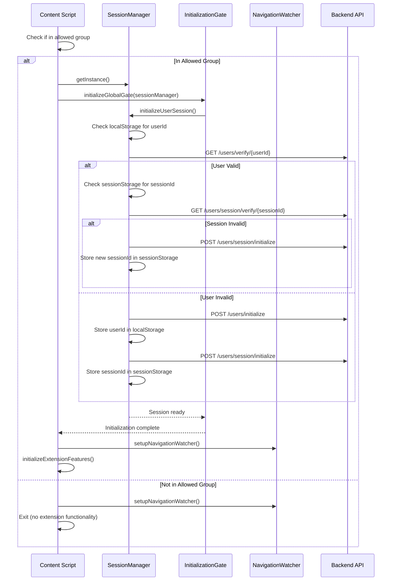
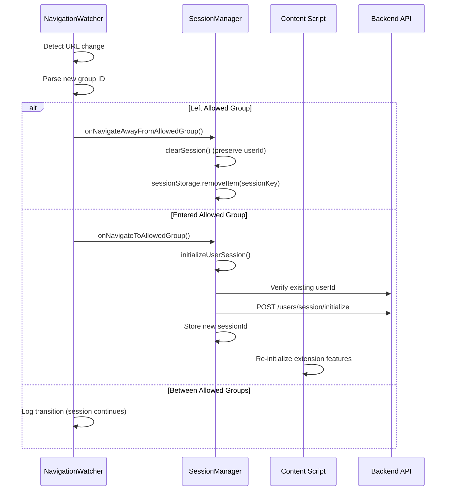
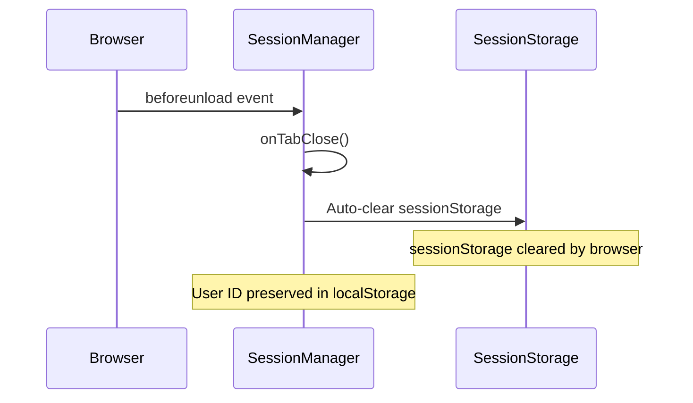

# Session Management Architecture Documentation

## Table of Contents

1. [Overview](#overview)
2. [Architecture Principles](#architecture-principles)
3. [Component Architecture](#component-architecture)
4. [Session Lifecycle](#session-lifecycle)
5. [Storage Strategy](#storage-strategy)
6. [API Integration](#api-integration)
7. [Security Model](#security-model)
8. [Error Handling](#error-handling)
9. [Performance Considerations](#performance-considerations)
10. [Testing Strategy](#testing-strategy)
11. [Troubleshooting](#troubleshooting)
12. [API Reference](#api-reference)

## Overview

The AI Slop Detection browser extension implements a sophisticated session management system that ensures secure, isolated, and persistent user sessions across browser tabs while maintaining strict validation requirements and URL-based activation controls.

### Key Features

- **Strict Initialization Blocking**: No extension activities occur without validated user/session IDs
- **URL-Based Activation**: Extension only functions within allowed Facebook groups
- **Per-Tab Session Isolation**: Each browser tab maintains its own session while sharing user identity
- **Persistent User Identity**: User IDs survive browser restarts and are never cleared
- **Automatic Session Lifecycle**: Sessions are created, validated, and cleaned up automatically
- **Robust Error Recovery**: Comprehensive fallback mechanisms for all failure scenarios

## Architecture Principles

### 1. Security-First Design

```typescript
// All extension activities require valid session
await protectedExecute(async () => {
  const sessionData = requireGlobalInitialization();
  return await apiCall({ userId: sessionData.userId });
}, 'apiCall');
```

### 2. Tab Isolation

```typescript
// Each tab gets unique session identifier
const tabId = SessionManager.getTabId(); // unique per tab
const sessionKey = `ai-slop-session-id-${tabId}`;
sessionStorage.setItem(sessionKey, sessionId);
```

### 3. Fail-Safe Initialization

```typescript
// Extension waits for complete validation
await initializeGlobalGate(sessionManager); // BLOCKS until ready
await initializeExtensionFeatures();        // Only after validation
```

## Component Architecture

### Core Components

```
┌─────────────────────────────────────────────────────────────┐
│                    Browser Extension                        │
├─────────────────────┬───────────────────┬───────────────────┤
│   Content Script    │  Background Script │   Popup/Options   │
│                     │                   │                   │
│ ┌─────────────────┐ │ ┌───────────────┐ │                   │
│ │ SessionManager  │ │ │ API Gateway   │ │                   │
│ │ (Tab-specific)  │ │ │ Message Handler│ │                   │
│ └─────────────────┘ │ └───────────────┘ │                   │
│                     │                   │                   │
│ ┌─────────────────┐ │ ┌───────────────┐ │                   │
│ │NavigationWatcher│ │ │ State Manager │ │                   │
│ └─────────────────┘ │ └───────────────┘ │                   │
│                     │                   │                   │
│ ┌─────────────────┐ │                   │                   │
│ │InitializationGat│ │                   │                   │
│ └─────────────────┘ │                   │                   │
└─────────────────────┴───────────────────┴───────────────────┘
                           │
                           ▼
┌─────────────────────────────────────────────────────────────┐
│                    Backend API                              │
├─────────────────────┬───────────────────┬───────────────────┤
│   User Endpoints    │ Session Endpoints │  Chat Endpoints   │
│                     │                   │                   │
│ POST /users/        │ POST /users/      │ POST /chat/send   │
│      initialize     │      session/     │                   │
│                     │      initialize   │ GET /chat/        │
│ GET /users/         │                   │     history/{id}  │
│     verify/{id}     │ GET /users/       │                   │
│                     │     session/      │                   │
│                     │     verify/{id}   │                   │
└─────────────────────┴───────────────────┴───────────────────┘
                           │
                           ▼
┌─────────────────────────────────────────────────────────────┐
│                    Database Layer                           │
├─────────────────────┬───────────────────┬───────────────────┤
│      User Table     │   Session Table   │   Chat Table      │
│                     │                   │                   │
│ • id (UUID)         │ • id (UUID)       │ • id (UUID)       │
│ • browser_info      │ • user_id (FK)    │ • post_id         │
│ • timezone          │ • started_at      │ • user_id (FK)    │
│ • locale            │ • last_active     │ • message         │
│ • experiment_groups │ • client_data     │ • role            │
│ • created_at        │ • created_at      │ • created_at      │
└─────────────────────┴───────────────────┴───────────────────┘
```

### Component Responsibilities

#### **SessionManager** (`shared/SessionManager.ts`)
- **Primary Role**: Centralized session lifecycle management
- **Scope**: Tab-specific singleton instance
- **Responsibilities**:
  - User/session initialization and validation
  - Tab-specific storage management
  - Session state tracking and cleanup
  - Integration with backend verification APIs

#### **NavigationWatcher** (`content/utils/NavigationWatcher.ts`)
- **Primary Role**: URL-based session lifecycle control
- **Scope**: Per-tab instance tied to SessionManager
- **Responsibilities**:
  - Monitor Facebook group URL changes
  - Detect transitions between allowed/non-allowed groups
  - Trigger session initialization/cleanup on navigation
  - Handle SPA navigation events

#### **InitializationGate** (`shared/InitializationGate.ts`)
- **Primary Role**: Activity blocking until session validation
- **Scope**: Global singleton with tab-aware session tracking
- **Responsibilities**:
  - Block all extension activities until session ready
  - Provide protected execution wrappers
  - Manage initialization timeouts and errors
  - Track initialization status and metrics

## Session Lifecycle

### 1. Initial Page Load



### 2. Navigation Between Groups



### 3. Tab Close/Reload



## Storage Strategy

### Storage Layers

| Storage Type | Scope | Persistence | Use Case | Keys |
|--------------|--------|-------------|----------|------|
| **localStorage** | Browser-wide | Permanent | User Identity | `ai-slop-user-id` |
| **sessionStorage** | Tab-specific | Session | Tab Sessions | `ai-slop-session-id-{tabId}` |
| **Memory** | Tab-specific | Page Load | Active Session | SessionManager instance |

### Storage Implementation

#### **User ID Storage** (Browser-wide)
```typescript
// Persistent across browser restarts, never cleared
const USER_ID_KEY = 'ai-slop-user-id';

// Set user ID (only on initialization)
localStorage.setItem(USER_ID_KEY, backendUserId);

// Get user ID (always available once set)
const userId = localStorage.getItem(USER_ID_KEY);
```

#### **Session ID Storage** (Tab-specific)
```typescript
// Generate unique tab identifier
const tabId = `tab_${Date.now()}_${Math.random().toString(36).substr(2, 9)}`;
const sessionKey = `ai-slop-session-id-${tabId}`;

// Store session for current tab only
sessionStorage.setItem(sessionKey, sessionId);

// Retrieve session for current tab
const sessionId = sessionStorage.getItem(sessionKey);
```

#### **Session Data** (In-Memory)
```typescript
interface UserSessionData {
  userId: string;           // From localStorage
  sessionId: string;        // From sessionStorage  
  isNewUser: boolean;       // Initialization state
  isNewSession: boolean;    // Initialization state
  startTime: number;        // Session start timestamp
  lastActivity: number;     // Last user activity
}
```

### Storage Cleanup

#### **Automatic Cleanup**
- **sessionStorage**: Cleared automatically by browser on tab close
- **Memory**: Cleared automatically on page unload
- **localStorage**: Persists permanently (by design)

#### **Manual Cleanup**
```typescript
// Clear session (navigation away from allowed group)
export async function clearSession(): Promise<void> {
  const tabId = SessionManager.getTabId();
  const sessionKey = `ai-slop-session-id-${tabId}`;
  sessionStorage.removeItem(sessionKey);
}

// Clear all data (complete reset - rare)
export async function clearUserSession(): Promise<void> {
  localStorage.removeItem('ai-slop-user-id');
  await clearSession();
}
```

## API Integration

### Backend Endpoints

#### **User Management**

##### `POST /users/initialize`
Creates a new user with browser fingerprinting and experiment assignment.

**Request**:
```typescript
interface UserInitRequest {
  browser_info: Record<string, unknown>;
  timezone: string;
  locale: string;
  client_ip?: string;
}
```

**Response**:
```typescript
interface UserInitResponse {
  user_id: string;           // UUID
  experiment_groups: string[]; // A/B test groups
}
```

**Implementation**:
```typescript
// Browser extension usage
const response = await initializeUser({
  browser_info: {
    name: 'Chrome',
    userAgent: navigator.userAgent,
    platform: navigator.platform,
    language: navigator.language,
  },
  timezone: Intl.DateTimeFormat().resolvedOptions().timeZone,
  locale: navigator.language,
});

localStorage.setItem('ai-slop-user-id', response.user_id);
```

##### `GET /users/verify/{user_id}`
Validates that a user ID exists and is active.

**Response**:
```typescript
interface UserVerifyResponse {
  valid: boolean;
  user_id: string;
}
```

#### **Session Management**

##### `POST /users/session/initialize`
Creates a new session for an existing user.

**Request**:
```typescript
interface SessionInitRequest {
  user_id: string;
  browser_info?: Record<string, unknown>;
  timezone?: string;
  locale?: string;
}
```

**Response**:
```typescript
interface SessionInitResponse {
  session_id: string; // UUID
}
```

##### `GET /users/session/verify/{session_id}`
Validates that a session ID exists and is active.

**Query Parameters**:
- `user_id` (optional): Verify session belongs to specific user

**Response**:
```typescript
interface SessionVerifyResponse {
  valid: boolean;
  session_id: string;
}
```

### API Call Protection

All API calls in the browser extension are wrapped with session protection:

```typescript
// Protected API call pattern
const response = await protectedExecute(async () => {
  const sessionData = requireGlobalInitialization();
  return await apiCall({
    userId: sessionData.userId,
    sessionId: sessionData.sessionId,
    // ... other parameters
  });
}, 'apiCallName');
```

### Message Passing Architecture

#### **Content Script → Background Script**

```typescript
// Content script sends protected request
const response = await sendAiSlopRequest({
  content: postContent,
  postId: postId,
  // Session data automatically included by protection layer
});
```

#### **Background Script → Backend API**

```typescript
// Background script adds session context
chrome.runtime.onMessage.addListener((message, sender, sendResponse) => {
  if (message.type === MessageType.AiSlopRequest) {
    // Session validation happens in content script via InitializationGate
    requestAiSlop(message)
      .then(sendResponse)
      .catch(err => sendResponse({ error: err.message }));
    return true;
  }
});
```

## Security Model

### Threat Model

| Threat | Mitigation | Implementation |
|--------|------------|----------------|
| **Unauthorized API Access** | Session validation required | `requireGlobalInitialization()` |
| **Session Hijacking** | Tab-specific sessions | Unique tab IDs in storage keys |
| **Cross-Tab Interference** | Storage isolation | `sessionStorage` with tab prefixes |
| **Persistent Tracking** | User consent + secure storage | localStorage with UUID only |
| **Replay Attacks** | Session expiration | Backend session validation |

### Security Controls

#### **1. Initialization Blocking**
```typescript
// NO extension functionality without valid session
if (!initializationGate.isReady()) {
  throw new Error('Session validation required');
}
```

#### **2. URL Validation**
```typescript
// Only activate in allowed Facebook groups
const ALLOWED_GROUP_IDS = ['1280044857038905', '1638417209555402'];
if (!ALLOWED_GROUP_IDS.includes(currentGroupId)) {
  return; // No extension functionality
}
```

#### **3. Session Validation**
```typescript
// All API calls verify session server-side
const isValid = await verifySession(sessionId, userId);
if (!isValid) {
  // Force re-initialization
  await sessionManager.initializeUserSession();
}
```

#### **4. Data Minimization**
```typescript
// Only store essential identifiers
localStorage: { 'ai-slop-user-id': 'uuid-only' }
sessionStorage: { 'ai-slop-session-id-{tab}': 'uuid-only' }
// No sensitive data in browser storage
```

## Error Handling

### Error Categories

#### **1. Initialization Errors**

```typescript
class SessionInitializationError extends Error {
  constructor(message: string, public cause?: Error) {
    super(`Session initialization failed: ${message}`);
  }
}

// Handling
try {
  await sessionManager.initializeUserSession();
} catch (error) {
  if (error instanceof SessionInitializationError) {
    // Log error, show user-friendly message
    logger.error('Session setup failed', error);
    // Retry or fallback to limited functionality
  }
}
```

#### **2. Network Errors**

```typescript
// Automatic retry with exponential backoff
const response = await fetchJsonWithRetry(endpoint, options, {
  retries: 3,
  backoffBaseMs: 500,
  timeoutMs: 30000
});
```

#### **3. Validation Errors**

```typescript
// Graceful session recovery
if (!sessionValid) {
  logger.warn('Session invalid, re-initializing');
  await sessionManager.initializeUserSession();
  // Retry original operation
}
```

### Error Recovery Strategies

| Error Type | Recovery Strategy | Implementation |
|------------|------------------|----------------|
| **Backend Unavailable** | Local fallback + retry | Queue operations, retry with backoff |
| **Invalid Session** | Re-initialize | Clear session, create new one |
| **Network Timeout** | Exponential backoff | Built into fetchJsonWithRetry |
| **Storage Error** | In-memory fallback | Use memory-only session data |
| **Initialization Timeout** | User notification | Show loading state, offer retry |

## Performance Considerations

### Optimization Strategies

#### **1. Lazy Initialization**
```typescript
// Don't initialize until needed
if (!isInAllowedGroup()) {
  setupNavigationWatcherOnly(); // Minimal footprint
  return;
}
```

#### **2. Debounced Navigation**
```typescript
// Prevent excessive navigation checks
const debouncedNavigationHandler = debounce(handleLocationChange, 100);
window.addEventListener('locationchange', debouncedNavigationHandler);
```

#### **3. Memory Management**
```typescript
// Clean up resources on navigation away
onNavigateAwayFromAllowedGroup(): void {
  this.clearSession();
  this.observer?.disconnect();
  this.eventListeners?.cleanup();
}
```

#### **4. Storage Efficiency**
```typescript
// Only store essential data
const sessionData = {
  userId: string,    // 36 bytes (UUID)
  sessionId: string, // 36 bytes (UUID)
  // No large objects or user data
};
```

### Performance Metrics

| Metric | Target | Measurement |
|--------|--------|-------------|
| **Initialization Time** | < 500ms | First API call ready |
| **Navigation Detection** | < 100ms | URL change to session update |
| **Memory Usage** | < 5MB | Chrome DevTools Memory tab |
| **Storage Usage** | < 1KB | localStorage + sessionStorage |
| **API Response Time** | < 2s | Backend validation calls |

## Testing Strategy

### Test Categories

#### **1. Unit Tests**

```typescript
describe('SessionManager', () => {
  it('should initialize user session correctly', async () => {
    const sessionManager = SessionManager.getInstance();
    const mockBackendResponse = { user_id: 'test-uuid', experiment_groups: [] };
    
    mockApi.initializeUser.mockResolvedValue(mockBackendResponse);
    
    const session = await sessionManager.initializeUserSession();
    
    expect(session.userId).toBe('test-uuid');
    expect(localStorage.getItem('ai-slop-user-id')).toBe('test-uuid');
  });
});
```

#### **2. Integration Tests**

```typescript
describe('Session Integration', () => {
  it('should handle complete session lifecycle', async () => {
    // Test initialization → validation → API calls → cleanup
    const sessionManager = SessionManager.getInstance();
    const gate = InitializationGate.getInstance();
    
    await gate.initialize(sessionManager);
    
    const apiResponse = await protectedExecute(async () => {
      return await mockApiCall();
    });
    
    expect(apiResponse).toBeDefined();
    
    sessionManager.onNavigateAwayFromAllowedGroup();
    expect(sessionStorage.length).toBe(0);
  });
});
```

#### **3. End-to-End Tests**

```typescript
describe('Extension E2E', () => {
  it('should prevent functionality outside allowed groups', async () => {
    // Navigate to non-allowed group
    await page.goto('https://facebook.com/groups/non-allowed-group');
    
    // Verify no AI slop icons appear
    const icons = await page.$$('.ai-slop-icon');
    expect(icons).toHaveLength(0);
    
    // Navigate to allowed group
    await page.goto('https://facebook.com/groups/1280044857038905');
    
    // Verify functionality activates
    await page.waitForSelector('.ai-slop-icon', { timeout: 5000 });
  });
});
```

## Troubleshooting

### Common Issues

#### **1. Session Not Initializing**

**Symptoms**: Extension appears inactive in allowed groups

**Diagnosis**:
```typescript
// Check initialization status
const gate = getGlobalGate();
const status = gate.getStatus();
console.log('Initialization status:', status);

// Check session manager state
const sessionManager = SessionManager.getInstance();
const session = sessionManager.getCurrentSession();
console.log('Session state:', session);
```

**Solutions**:
- Verify backend endpoints are accessible
- Check browser console for network errors
- Verify URL matches allowed group IDs
- Clear storage and retry initialization

#### **2. Cross-Tab Session Issues**

**Symptoms**: Sessions interfering between tabs

**Diagnosis**:
```typescript
// Check tab isolation
const tabId = SessionManager.getTabId();
const sessionKeys = Object.keys(sessionStorage).filter(
  key => key.startsWith('ai-slop-session-id-')
);
console.log('Tab ID:', tabId);
console.log('Session keys:', sessionKeys);
```

**Solutions**:
- Ensure unique tab ID generation
- Verify sessionStorage key prefixes
- Check for tab ID collisions

#### **3. Navigation Not Detected**

**Symptoms**: Session not clearing when leaving allowed groups

**Diagnosis**:
```typescript
// Check navigation watcher state
const watcher = navigationWatcher; // access via debug global
const currentState = watcher.getCurrentState();
console.log('Navigation state:', currentState);

// Verify group ID extraction
const groupId = getCurrentGroupIdFromUrl();
console.log('Current group ID:', groupId);
```

**Solutions**:
- Verify URL parsing logic
- Check for SPA navigation events
- Ensure debouncing not blocking detection

### Debug Commands

```typescript
// Debug session state (run in browser console)
window.debugAiSlopSession = {
  getSessionState: () => {
    const gate = getGlobalGate();
    const sessionManager = SessionManager.getInstance();
    return {
      gateStatus: gate.getStatus(),
      sessionData: sessionManager.getCurrentSession(),
      storage: {
        userId: localStorage.getItem('ai-slop-user-id'),
        sessionKeys: Object.keys(sessionStorage).filter(k => k.includes('session'))
      }
    };
  },
  clearAllSessions: () => {
    Object.keys(sessionStorage)
      .filter(key => key.startsWith('ai-slop-session-id-'))
      .forEach(key => sessionStorage.removeItem(key));
  },
  reinitialize: async () => {
    const gate = getGlobalGate();
    gate.reset();
    const sessionManager = SessionManager.getInstance();
    await sessionManager.initializeUserSession();
  }
};
```

## API Reference

### SessionManager

#### Methods

##### `getInstance(config?: SessionManagerConfig): SessionManager`
Gets singleton instance for current tab.

```typescript
const sessionManager = SessionManager.getInstance({
  requireValidSession: true,
  enableLogging: true
});
```

##### `async initializeUserSession(): Promise<UserSessionData>`
Initializes/validates user and session. Blocks until complete.

```typescript
const sessionData = await sessionManager.initializeUserSession();
// sessionData.userId - validated user ID
// sessionData.sessionId - current session ID
// sessionData.isNewUser - true if user was just created
// sessionData.isNewSession - true if session was just created
```

##### `requireValidSession(): UserSessionData`
Gets current session or throws error if not initialized.

```typescript
try {
  const session = sessionManager.requireValidSession();
  // Use session.userId, session.sessionId
} catch (error) {
  // Session not ready - should not happen in protected execution
}
```

##### `onNavigateToAllowedGroup(): Promise<void>`
Called when entering allowed Facebook group. Initializes session.

##### `onNavigateAwayFromAllowedGroup(): void`
Called when leaving allowed Facebook group. Clears session.

### InitializationGate

#### Methods

##### `getInstance(): InitializationGate`
Gets global singleton instance.

##### `async initialize(sessionManager: SessionManager): Promise<void>`
Initialize gate with session manager. Blocks until session ready.

##### `async waitForInitialization(): Promise<void>`
Wait for initialization to complete. Used internally.

##### `requireInitialized(): UserSessionData`
Get session data or throw error if not ready.

##### `async protectedExecution<T>(operation: () => T | Promise<T>, operationName?: string): Promise<T>`
Execute operation only after session validation.

```typescript
const result = await gate.protectedExecution(async () => {
  return await apiCall();
}, 'apiCall');
```

#### Global Functions

##### `async protectedExecute<T>(operation: () => T | Promise<T>, operationName?: string): Promise<T>`
Execute protected operation using global gate.

```typescript
import { protectedExecute } from '@/shared/InitializationGate';

const result = await protectedExecute(async () => {
  const sessionData = requireGlobalInitialization();
  return await sendAiSlopRequest({
    userId: sessionData.userId,
    // ... other params
  });
}, 'sendAiSlopRequest');
```

##### `requireGlobalInitialization(): UserSessionData`
Get validated session data from global gate.

### NavigationWatcher

#### Constructor

```typescript
const watcher = new NavigationWatcher(sessionManager, {
  enableLogging: true,
  debounceMs: 100
});
```

#### Methods

##### `getCurrentState(): NavigationState`
Get current navigation state including URL and group information.

##### `isCurrentlyInAllowedGroup(): boolean`
Check if currently in an allowed Facebook group.

##### `destroy(): void`
Clean up event listeners and resources.

### Storage Functions

#### User Session Storage

```typescript
import { 
  verifyAndInitializeUserSession,
  hasStoredUserSession,
  clearSession,
  clearUserSession 
} from '@/content/utils/initialization';

// Initialize/validate user session
const sessionInfo = await verifyAndInitializeUserSession();

// Quick check for existing session
const hasSession = hasStoredUserSession();

// Clear current tab's session
await clearSession();

// Clear all session data (rare)
await clearUserSession();
```

#### Storage Key Management

```typescript
import { 
  getTabSpecificSessionKey,
  getAllTabSessionKeys,
  cleanupOrphanedTabSessions 
} from '@/shared/constants';

// Get session key for current tab
const sessionKey = getTabSpecificSessionKey(tabId);

// Get all session keys
const sessionKeys = getAllTabSessionKeys();

// Clean up old sessions
cleanupOrphanedTabSessions();
```

---

## Conclusion

This session management system provides a robust, secure, and scalable foundation for the AI Slop Detection browser extension. The architecture ensures that user privacy is protected, sessions are properly isolated, and the extension only operates within authorized contexts while maintaining high performance and reliability.

For additional support or questions about implementation details, refer to the troubleshooting section or examine the source code in the respective component files.